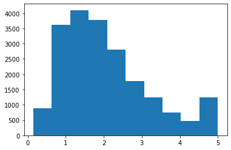
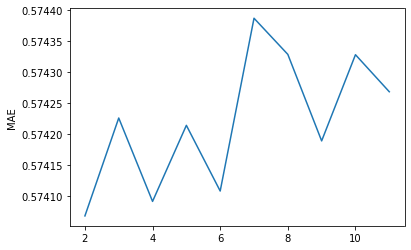
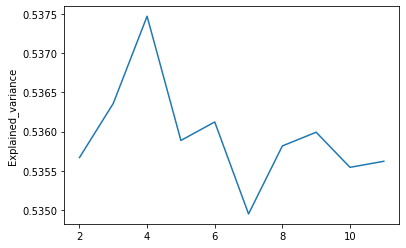
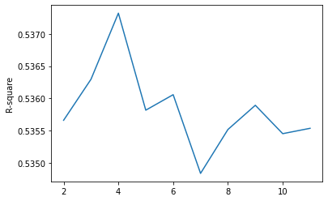

```python
import pandas as pd
import numpy as np
import matplotlib.pyplot as plt
from sklearn import datasets

```


```python
housing = datasets.fetch_california_housing()
```


```python
housing.data.shape, housing.target.shape
```


    ((20640, 8), (20640,))


```python
data = pd.DataFrame(data= np.c_[housing['data'], housing['target']],
                     columns= housing['feature_names'] + ['target'])
```


```python
data.info()
```

    <class 'pandas.core.frame.DataFrame'>
    RangeIndex: 20640 entries, 0 to 20639
    Data columns (total 9 columns):
     #   Column      Non-Null Count  Dtype  
    ---  ------      --------------  -----  
     0   MedInc      20640 non-null  float64
     1   HouseAge    20640 non-null  float64
     2   AveRooms    20640 non-null  float64
     3   AveBedrms   20640 non-null  float64
     4   Population  20640 non-null  float64
     5   AveOccup    20640 non-null  float64
     6   Latitude    20640 non-null  float64
     7   Longitude   20640 non-null  float64
     8   target      20640 non-null  float64
    dtypes: float64(9)
    memory usage: 1.4 MB
    


```python
data.isna().sum()
```


    MedInc        0
    HouseAge      0
    AveRooms      0
    AveBedrms     0
    Population    0
    AveOccup      0
    Latitude      0
    Longitude     0
    target        0
    dtype: int64


```python
data.describe()
```


<div>
<style scoped>
    .dataframe tbody tr th:only-of-type {
        vertical-align: middle;
    }

    .dataframe tbody tr th {
        vertical-align: top;
    }

    .dataframe thead th {
        text-align: right;
    }
</style>
<table border="1" class="dataframe">
  <thead>
    <tr style="text-align: right;">
      <th></th>
      <th>MedInc</th>
      <th>HouseAge</th>
      <th>AveRooms</th>
      <th>AveBedrms</th>
      <th>Population</th>
      <th>AveOccup</th>
      <th>Latitude</th>
      <th>Longitude</th>
      <th>target</th>
    </tr>
  </thead>
  <tbody>
    <tr>
      <th>count</th>
      <td>20640.000000</td>
      <td>20640.000000</td>
      <td>20640.000000</td>
      <td>20640.000000</td>
      <td>20640.000000</td>
      <td>20640.000000</td>
      <td>20640.000000</td>
      <td>20640.000000</td>
      <td>20640.000000</td>
    </tr>
    <tr>
      <th>mean</th>
      <td>3.870671</td>
      <td>28.639486</td>
      <td>5.429000</td>
      <td>1.096675</td>
      <td>1425.476744</td>
      <td>3.070655</td>
      <td>35.631861</td>
      <td>-119.569704</td>
      <td>2.068558</td>
    </tr>
    <tr>
      <th>std</th>
      <td>1.899822</td>
      <td>12.585558</td>
      <td>2.474173</td>
      <td>0.473911</td>
      <td>1132.462122</td>
      <td>10.386050</td>
      <td>2.135952</td>
      <td>2.003532</td>
      <td>1.153956</td>
    </tr>
    <tr>
      <th>min</th>
      <td>0.499900</td>
      <td>1.000000</td>
      <td>0.846154</td>
      <td>0.333333</td>
      <td>3.000000</td>
      <td>0.692308</td>
      <td>32.540000</td>
      <td>-124.350000</td>
      <td>0.149990</td>
    </tr>
    <tr>
      <th>25%</th>
      <td>2.563400</td>
      <td>18.000000</td>
      <td>4.440716</td>
      <td>1.006079</td>
      <td>787.000000</td>
      <td>2.429741</td>
      <td>33.930000</td>
      <td>-121.800000</td>
      <td>1.196000</td>
    </tr>
    <tr>
      <th>50%</th>
      <td>3.534800</td>
      <td>29.000000</td>
      <td>5.229129</td>
      <td>1.048780</td>
      <td>1166.000000</td>
      <td>2.818116</td>
      <td>34.260000</td>
      <td>-118.490000</td>
      <td>1.797000</td>
    </tr>
    <tr>
      <th>75%</th>
      <td>4.743250</td>
      <td>37.000000</td>
      <td>6.052381</td>
      <td>1.099526</td>
      <td>1725.000000</td>
      <td>3.282261</td>
      <td>37.710000</td>
      <td>-118.010000</td>
      <td>2.647250</td>
    </tr>
    <tr>
      <th>max</th>
      <td>15.000100</td>
      <td>52.000000</td>
      <td>141.909091</td>
      <td>34.066667</td>
      <td>35682.000000</td>
      <td>1243.333333</td>
      <td>41.950000</td>
      <td>-114.310000</td>
      <td>5.000010</td>
    </tr>
  </tbody>
</table>
</div>


```python
plt.hist(data.target)
plt.show()
```


    

    


```python
X = data.iloc[:, :-3].copy()
y = data['target'].copy()
```


```python
from sklearn.model_selection import train_test_split
X_train, X_test, y_train, y_test = train_test_split(X, y, test_size=0.2, random_state=0)
```


```python
from sklearn.linear_model import LinearRegression

# Run a simple LinearRegression model
linreg = LinearRegression()
linreg.fit(X_train,y_train)
linreg.score(X_test, y_test) #R-square
```


    0.5250770679886767


```python
from sklearn.model_selection import cross_val_score, KFold

# Cross-validation with 5-fold computin
kf = KFold(n_splits=5, shuffle=True, random_state=0)
scores = -1 * cross_val_score(LinearRegression(), X, y,
                         cv=kf, scoring='neg_mean_absolute_error')
print("MAE scores : {}".format(scores.mean()))
```

    MAE scores : 0.5742144717426506
    

### The scoring parameter
| **Scoring**                              | **Function**                               | **Comment**                        |
|--------------------------------------|----------------------------------------|--------------------------------|
| **Classification**                       |                                        |                                |
| ‘accuracy’                           | metrics.accuracy_score                 |                                |
| ‘balanced_accuracy’                  | metrics.balanced_accuracy_score        |                                |
| ‘top_k_accuracy’                     | metrics.top_k_accuracy_score           |                                |
| ‘average_precision’                  | metrics.average_precision_score        |                                |
| ‘neg_brier_score’                    | metrics.brier_score_loss               |                                |
| ‘f1’                                 | metrics.f1_score                       | for binary targets             |
| ‘f1_micro’                           | metrics.f1_score                       | micro-averaged                 |
| ‘f1_macro’                           | metrics.f1_score                       | macro-averaged                 |
| ‘f1_weighted’                        | metrics.f1_score                       | weighted average               |
| ‘f1_samples’                         | metrics.f1_score                       | by multilabel sample           |
| ‘neg_log_loss’                       | metrics.log_loss                       | requires predict_proba support |
| ‘precision’ etc.                     | metrics.precision_score                | suffixes apply as with ‘f1’    |
| ‘recall’ etc.                        | metrics.recall_score                   | suffixes apply as with ‘f1’    |
| ‘jaccard’ etc.                       | metrics.jaccard_score                  | suffixes apply as with ‘f1’    |
| ‘roc_auc’                            | metrics.roc_auc_score                  |                                |
| ‘roc_auc_ovr’                        | metrics.roc_auc_score                  |                                |
| ‘roc_auc_ovo’                        | metrics.roc_auc_score                  |                                |
| ‘roc_auc_ovr_weighted’               | metrics.roc_auc_score                  |                                |
| ‘roc_auc_ovo_weighted’               | metrics.roc_auc_score                  |                                |
| **Clustering**                           |                                        |                                |
| ‘adjusted_mutual_info_score’         | metrics.adjusted_mutual_info_score     |                                |
| ‘adjusted_rand_score’                | metrics.adjusted_rand_score            |                                |
| ‘completeness_score’                 | metrics.completeness_score             |                                |
| ‘fowlkes_mallows_score’              | metrics.fowlkes_mallows_score          |                                |
| ‘homogeneity_score’                  | metrics.homogeneity_score              |                                |
| ‘mutual_info_score’                  | metrics.mutual_info_score              |                                |
| ‘normalized_mutual_info_score’       | metrics.normalized_mutual_info_score   |                                |
| ‘rand_score’                         | metrics.rand_score                     |                                |
| ‘v_measure_score’                    | metrics.v_measure_score                |                                |
| **Regression**                           |                                        |                                |
| ‘explained_variance’                 | metrics.explained_variance_score       |                                |
| ‘max_error’                          | metrics.max_error                      |                                |
| ‘neg_mean_absolute_error’            | metrics.mean_absolute_error            |                                |
| ‘neg_mean_squared_error’             | metrics.mean_squared_error             |                                |
| ‘neg_root_mean_squared_error’        | metrics.mean_squared_error             |                                |
| ‘neg_mean_squared_log_error’         | metrics.mean_squared_log_error         |                                |
| ‘neg_median_absolute_error’          | metrics.median_absolute_error          |                                |
| ‘r2’                                 | metrics.r2_score                       |                                |
| ‘neg_mean_poisson_deviance’          | metrics.mean_poisson_deviance          |                                |
| ‘neg_mean_gamma_deviance’            | metrics.mean_gamma_deviance            |                                |
| ‘neg_mean_absolute_percentage_error’ | metrics.mean_absolute_percentage_error |                                |
| ‘d2_absolute_error_score’            | metrics.d2_absolute_error_score        |                                |
| ‘d2_pinball_score’                   | metrics.d2_pinball_score               |                                |
| ‘d2_tweedie_score’                   | metrics.d2_tweedie_score               |                                |


```python
from sklearn.linear_model import LinearRegression
from sklearn.preprocessing import PolynomialFeatures
from sklearn.pipeline import Pipeline


# Cross-validation with 7-fold computing
# Train model with Pipeline
pipeline = Pipeline(steps = [
    ('model', LinearRegression())
])
kf = KFold(n_splits=7, shuffle=True, random_state=0)
scores = -1 * cross_val_score(pipeline, X, y,
                         cv=7, scoring='neg_mean_absolute_error')
print("MAE scores : {}".format(scores.mean()))
```

    MAE scores : 0.586537633383818
    


```python
# Find best hyperparameter: cv for model
def train_model(model, n_splits, scoring=None):
    pipeline = Pipeline(steps=[('model', model)])
    kf = KFold(n_splits=n_splits, shuffle=True, random_state=0)
    if scoring == 'neg_mean_absolute_error' :
        scores = -1 * cross_val_score(pipeline, X, y,
                                     cv=kf,
                                     scoring=scoring)
    else:
        scores = 1 * cross_val_score(pipeline, X, y,
                                     cv=kf,
                                     scoring=scoring)
    return scores.mean()
```


```python
results = []
cv = 10
for i in range(cv):
    i += 2
    results.append(train_model(LinearRegression(), i, 'neg_mean_absolute_error'))
plt.plot( [i+2 for i in range(cv) ], results)
plt.ylabel('MAE')
plt.show()
```


    

    


```python
results = []
cv = 10
for i in range(cv):
    i += 2
    results.append(train_model(LinearRegression(), i, scoring='explained_variance'))
    
plt.plot( [i+2 for i in range(cv) ], results)
plt.ylabel('Explained_variance')
plt.show()
```


    

    


```python
results = []
cv = 10
for i in range(cv):
    i += 2
    results.append(train_model(LinearRegression(), i, 'r2'))
    
plt.plot( [i+2 for i in range(cv) ], results)
plt.ylabel('R-square')
plt.show()
```


    

    


```python

```
